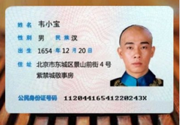

# 银行卡号/身份证号/手机号的组成及校验

>本文总结了常见的银行卡号、身份证号和手机号的组成及校验方法，并提供了完整的示例代码。

## 1. 银行卡号（Bank Card Number）

平时生活中钱包里面充满了各种各样的卡，如信用卡、借记卡、礼品卡、会员卡和VIP卡等等，这些卡号并非随意定制的，都遵循国际标准 [ISO/IEC 7812](https://en.wikipedia.org/wiki/ISO/IEC_7812)，开发过程中接触到较多的是银行卡号，下面主要说下银行卡号的组成和校验。银行卡一般长下面这样：


>银行卡号：**6225768888888888**

### 1.1 卡号组成

银行卡号一般是 16 位（信用卡/借记卡）或 19 位（借记卡）

```
  /--MII      
_/     /--IIN(BIN)
      /     /--个人账户标识，长度 6-12 位
_____/ ____/ _/--校验位
622576 8...8 8
```

**第 1 位**

卡号首位表示主要产业标识符([Major Industry Identifie, MII](https://en.wikipedia.org/wiki/ISO/IEC_7812))，由国际标准化组织于1989年首次发布，通过该值可以区分卡号的发行者所属行业，所有取值见下表：

|卡号首位|发行者类别|
|-|-|
|0|[ISO/TC 68](https://en.wikipedia.org/wiki/ISO/TC_68)及其他行业|
|1|航空|
|2|航空、金融和其他未来行业|
|3|旅游和娱乐业|
|4|银行业和金融业|
|5|银行业和金融业|
|6|商业和银行金融业|
|7|使用和其他未来行业|
|8|医疗、电信和其他未来行业|
|9|国家标准机构|

**第 1-6 位**

卡号前 6 位表示发行者标识代码([Issuer Identification Number, IIN](https://en.wikipedia.org/wiki/Payment_card_number#Issuer_identification_number_.28IIN.29))，也称位发卡行识别码(Bank Identification Number, BIN)，包含第 1 位产业标识符 MII，通过 IIN 可以区分卡号的发行机构。

|发布网|IIN 范围|长度|校验算法|
|-|-|-|-|
|中国银联(China UnionPay)|62|16-19|Luhn algorithm|
|美国运通(American Express)|34,37|15|Luhn algorithm|
|Visa|4|13,16,19|Luhn algorithm|
|[more...](https://en.wikipedia.org/wiki/Payment_card_number#Issuer_identification_number_.28IIN.29)|.|.|.|
    
**第 7-X 位(长度可变，6-12位)**
除去卡号前 6 位和最后 1 位，中间数字表示个人账号标识，中间数字由发行机构自定义，由6-12位数字组成。每个银行的个人账号标识规则有所不同。有的银行在这部分内容中会包含分行、支行、储蓄网点等代码信息。有得银行可能就没有这么详细，会使用自然流水顺序码。

**最后 1 位**

最后 1 位表示校验位，由卡号前面的数字(不含最后 1 位)采用[Luhn算法](https://en.wikipedia.org/wiki/Luhn_algorithm)计算得出。

### 1.2 卡号校验

卡号的最后一位都是通过[Luhn算法](https://en.wikipedia.org/wiki/Luhn_algorithm)进行计算或校验。luhn 算法也称为“mod 10”算法(源于算法最后一步操作是模10)，它是一个简单的 checksum 算法。使用 luhn 算法校验的数字串，最后一位是校验位，使用 luhn 算法可校验数字串是否有效。

其具体算法步骤如下：
1. 从待校验的数字串的最右侧（校验位）开始，向左遍历，奇数位数字累加，偶数位数字进行下面处理后的结果累加
  1.1 偶数位数字乘以 2 后，如果结果大于 9，则将结果的个位和十位相加后返回（16: 1+6=7），否则返回结果
2. 上一步累加的结果模 10 后，如果结果为 0，则数字串是有效的，否则是无效的

假设数字串为`7992739871x`（`x`是校验位），下面是算法第 1 步的计算过程示例：

|数字串|7|9|9|2|7|3|9|8|7|1|x|
|-|-|-|-|-|-|-|-|-|-|-|-|
|乘以2|7|**18**|9|**4**|7|**6**|9|**16**|7|**2**|x|
|处理|7|9|9|4|7|6|9|7|7|2|x|

luhn 校验算法的 JavaScript 实现如下：
```javascript
/**
 * luhn check algorightm
 * @param {string} input - card NO
 * @returns {boolean} return true if input is valid, otherwise return false
 */
function luhnCheck(input) {
    var sum = 0
    for (var i = input.length - 1; i >= 0; --i) {
        var digit = parseInt(input[i], 10) * (i % 2 === 0 ? 2 : 1)
        if (digit <= 9) {
            sum += digit   
        } else {
            sum += (digit % 10 + parseInt(digit / 10, 10))
        }
    }
    return sum % 10 === 0
}
```

上面的校验算法仅校验卡号是否符合规则，实际应用还需要根据具体场景校验卡号的开头位和长度等，下面是银联卡号完整的校验函数：
```javascript
// return true if input is a valid bank card no, otherwise return false
function checkBankCardNo (input) {
    return /^62(\d{14}|\d{17})$/.test(input) && luhnCheck(input)
}
```

上面两段代码的在线示例：<https://runkit.com/whinc/luhn-check-algorithm>

参考：

* [Payment card number | wikipedia](https://en.wikipedia.org/wiki/Payment_card_number)
* [Luhn algorithm | wikipedia](https://en.wikipedia.org/wiki/Luhn_algorithm)
* [银行卡号各个数字是什么含义？ | 知乎](https://www.zhihu.com/question/20880750#answer-4771564)

## 2. 身份证号（ID Card Number）

中国居民身份证


>身份证号：**11204416541220243X**

### 2.1 卡号组成

身份证号码一共有18位数字，各位数字代表的含义：
* 第`1,2`位数字表示：所在省份的代码； 
* 第`3,4`位数字表示：所在城市的代码； 
* 第`5,6`位数字表示：所在区县的代码；
* 第`7-14`位数字表示：出生年、月、日； 
* 第`15,16`位数字表示：所在地的派出所的代码；
* 第`17`位数字表示性别：奇数表示男性，偶数表示女性； 
* 第`18`位数字是校检码：根据前面十七位数字码，按照ISO 7064:1983.MOD 11-2校验码计算出来的校验码，取值 0-10（10 用 X 表示）。

```
     /-省份代码      /-出生年月日(YYYYMMDD）
    /  /-城市代码   /  /-所在地派出所代码
   /  /  /-区县代码/  / /-性别(奇-男，偶-女)
__/__/__/________/__/_/_/-校验位
11 20 44 16541220 24 3 X
```

**省市区(县)代码**

我们把身份证前六位地址码码，按ABCDEF表示。

AB 表示身份证主人所在的省(直辖市、自治区、特别行政区)代码。
```
11-15 京 津 冀 晋 蒙
21-23 辽 吉 黑
31-37 沪 苏 浙 皖 闽 赣 鲁
41-46 豫 鄂 湘 粤 桂 琼
50-54 渝 川 贵 云 藏
61-65 陕 甘 青 宁 新
81-82 港 澳
```

CD 表示地区代码（地级），省的城市代码从省会开始排，只有地级城市有独立的城市代码，而县级市没有。

EF 表示为县区代码（市辖区、郊区、郊县、县级市）。

例如，广东省深圳市南山区，对应的身份证前 6 位是`440305`

完整的全国省市区（县）代码可以参考中华人民共和国国家统计局[最新县及县以上行政区划代码（截止2016年7月31日）](http://www.stats.gov.cn/tjsj/tjbz/xzqhdm/201703/t20170310_1471429.html)。

**出生日期**

按照格式`YYYYMMDD`表示，例如公历一九九一年一月一日出生对应的日期为`19910101`

**派出所代码**

暂未查到官方的派出所代码出处，如果你知道，恳请在评论里告诉我。

### 2.2 身份证校验


身份证号最后一位使用ISO 7064:1983.MOD 11-2算法得出，其算法很简单，一句话描述：将每位数字与其对应的权重的乘积之和模11后查表。具体的计算过程见下面：

**第一步：计算权重之和**

每位数字拥有不同的权重`Wi`，其计算方法如下：

```
c = ∑(ai·Wi) mod 11, i=(1, 18], i ∈ N
```

公式说明：
`i`:表示号码字符从右至左（包括校验码在内）的位置序号，最右侧数字 i 为 1，计算时不包含最侧的校验位；
`ai`:表示第`i`位置上的号码字符值；
`Wi`:示第`i`位置上的加权因子，其数值依据公式`Wi=2^(i-1）mod 11`计算得出。 

由于身份证号固定 18 位，可以预先计算出所有权重值，后续查表加快校验过程。

|i|18|17|16|15|14|13|12|11|10|9|8|7|6|5|4|3|2|1|
|-|-|-|-|-|-|-|-|-|-|-|-|-|-|-|-|-|-|-|
|Wi|7|9|10|5|8|4|2|1|6|3|7|9|10|5|8|4|2|1|

**第二步：将上一步结果模 11 后查表**

计算出`c`后，根据下表查出对应的校验码：

|j|0|1|2|3|4|5|6|7|8|9|10|
|-|-|-|-|-|-|-|-|-|-|-|-|
|Q|1|0|X|9|8|7|6|5|4|3|2|

上面的表格是通过下面公式计算出来的：
```
Q = (12-j) mod 11, i=[0, 10], i ∈ N
```


算法的 JavaScript 实现如下：
```javascript
/**
 * Check input ID card no. is valid or not
 * @param {string} input - ID card no.
 * @returns return true if input card no. is valid, otherwise return false 
 */
function checkIDCardNo(input)  {
    var sum = 0
    var W = [7, 9, 10, 5, 8, 4, 2, 1, 6, 3, 7, 9, 10, 5, 8, 4, 2, 1]
    var Q = '10X97865432'
    
    for (var i = 0; i < input.length - 1; ++i) {
        sum += input[i] * W[i]
    }
    
    return Q[sum % 11] === input[i];
}
```

上面的校验算法仅身份证号是否符合 MOD 11 校验规则，实际应用还需要校验卡号的长度和类型，下面是身份证号完整的校验函数：
```javascript
// return true if input is a valid ID card no., otherwise return false
function checkIDCardNo2 (input) {
    return /^\d{17}(\d|X)$/.test(input) && checkIDCardNo(input)
}
```

上面两段代码的在线示例：<https://runkit.com/whinc/5a31213aeb0c1a0011c3af56>

参考：
* [Resident Identity Card | wikipedia](https://en.wikipedia.org/wiki/Resident_Identity_Card)
* [Identity Card Number | wikipeida](https://en.wikipedia.org/wiki/Resident_Identity_Card#Identity_card_number)

## 3 手机号（Phone Number）

中国手机号示例：`15975383481`

>电话号码分座机号和移动手机号，二者规则不同，这里只讨论移动手机号

### 3.1 手机号组成

中国使用的手机号码为11位，使用 MDN 结构`CC + MAC + H0 H1 H2 H3 + ABCD`，各字段含义如下：

`CC`：国家码
`MAC`：移动接入码，用于区分运营商
`H0H1H2H3`：HLR(Home Location Register) 归属识别码，由运营商统一分配，每个移动运营商会为全国的地级市编上一个四位数代码，用于识别手机归属地
`ABCD`：移动用户号，由各 HLR 自行分配，用于区分同一地区不同用户

```
     /-CC
    /   /-MAC
   /   /    /-HLR
__/___/____/____/-ABCD
86 134 1234 1234
```

中国大陆号码开头的含义及说明（不一定完整，仅作了解）：

|开头|含义|说明|
|---|----|---|
|`10`|电信服务号|10010中国联通服务中心，10050中国铁通服务中心，10060中国网通服务中心，10070中国卫通服务中心，10086中国移动服务中心等。|
|`11`|特种服务号|如110匪警，111电信内部测试，112报修，113、115国内人工长途挂号，114查号台，116国内人工长途查询，117报时，119火警等。|
|`12`|特殊民用号|如120（医院），121（天气预报），122交通事故告警，12312保护知识产权举报中心，12315消费投诉热线，12319城建服务，12348法律咨询，12358价格举报中心，12365质量监督，12366纳税服务，12369环境保护投诉。|
|`13`|通信号码段|130-133 归属中国联通，134-139 归属中国移动|
|`14`|.|.|
|`15`|通信号码段|153 归属中国联通，158-159 归属中国移动|
|`16`|声讯类号码|如160中国电信工人信息服务接入码，166务，167吉通计算机互联网业务接入码，168声讯服务，中国电信公众多媒体网接入码等。|
|`17`|长途电话服务|如170国内长途全自动话费查询台，173国内立接制长途半自动挂号台，176国内长途半自动查询台，177国内长途半自动班长台，179 IP语音服务接入码等。|
|`18`|通信号码段，服务号|如180邮政服务，184邮政编码查询接入码，185国家邮政局电话信息服务接入码，186移动服务中心，188固定电话交费台，189中国电信业务受理特服台等。|
|`19`|寻呼接入|191联通无线电人工寻呼接入码，192联通无线电自动寻呼接入码等等。|
|`20`,`30`|电话卡服务|
|`8`,`9`|电信及民用服务号|95501深圳发展银行，95502永安财产保险，95505天安保险，95508广州发展银行|

### 3.2 手机号的校验

根据上面表格整理的号码含义，可制定下面校验规则：
1. 号码长度为 11 位
2. 号码首位是`1`
3. 号码的第 2 位可以是`3,4,5,7,8`
```javascript
/**
 * check is input phone no. is valid
 * @param {string} input - input phone no.
 * @returns return true if input is a valid phone no., otherwise return false
 */
function checkPhoneNo(input) {
    return /^1[3|4|5|7|8][0-9]\d{8}$/.test(input)
}
```

上面代码的在线示例：<https://runkit.com/whinc/5a3274f8c8531200128328a7>

参考
* [Telephone numbers in China | wikipedia](https://en.wikipedia.org/wiki/Telephone_numbers_in_China)
* [手机号码 | 搜狗百科](http://baike.sogou.com/v23265397.htm?fromTitle=%E6%89%8B%E6%9C%BA%E5%8F%B7%E7%A0%81)
* [手机、电话号码编码组成及号段分配](http://www.360doc.com/content/12/0620/01/5733130_219320179.shtml)

## 4. 小结

本文总结了常见的银行卡号、身份证号和手机号的组成及校验方法，并提供了完整的示例代码。
